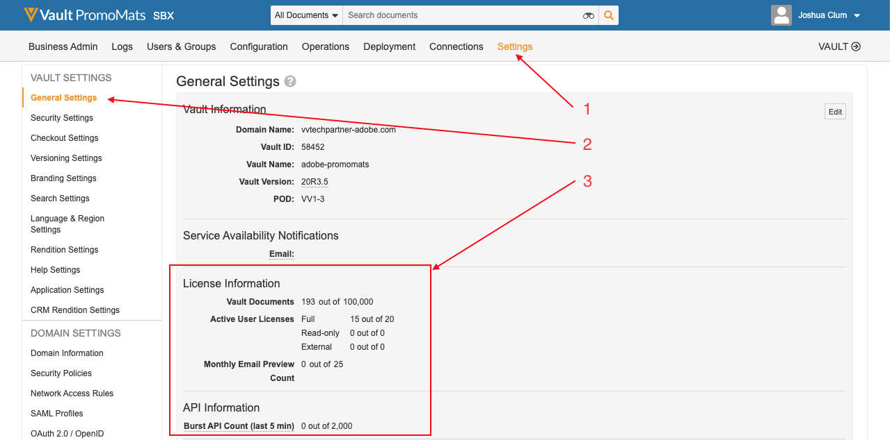

# Prácticas recomendadas, protecciones y avisos

## Versiones

Esta integración requiere las siguientes versiones mínimas de software:

* Adobe Experience Manager, 6.5.5+
* Veeva Vault PromoMats, 20R3.2+

## Privacidad de datos

Esta integración está diseñada para transferir contenido entre Adobe Experience Manager y Veeva Vault PromoMats. Como responsable del tratamiento de datos, su empresa es responsable de cumplir con las leyes y regulaciones de privacidad aplicables a su recopilación y uso de datos.

## Frecuencia de sincronización de contenido

El contenido y los metadatos de AEM se sincronizan de AEM a VPN cuando se activa el flujo de trabajo de integración. Esto se puede hacer de forma automática o manual. Los metadatos VPM se sincronizan de VPM a AEM. Esto se puede hacer automáticamente a través de un planificador o manualmente a través de un clic en un botón.

## Limitaciones de integración, prácticas recomendadas y protecciones

Tenga en cuenta las siguientes limitaciones al utilizar esta integración:

* Al sincronizar metadatos solo se admiten los siguientes tipos de datos: Texto y Texto multilínea.
* Aunque la integración admite contenido modular de AEM (fragmentos de contenido y fragmentos de experiencias), no admite contenido modular VPM.
* Los documentos vinculados a VPM no son compatibles.
* No se admite la sincronización de anotaciones visuales VPM de VPM a AEM.
* La integración no importa contenido de VPM a AEM.
* No se admite la validación de metadatos.
* El número de documentos está limitado en función de la licencia de Veeva. Ver [Limitaciones de licencias](#veeva-license-limitations).
* El número de llamadas API está limitado según la licencia de Veeva. Para obtener más información, consulte [Limitaciones de API](https://developer.veevavault.com/docs/#what-are-rate-limits). Ver [Limitaciones de licencias](#veeva-license-limitations).

## Limitaciones de licencia de Veeva

Puede monitorizar los límites de las instancias navegando hasta la configuración general de VPM.

