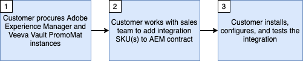

# Introducción a Veeva Vault PromoMats e integración con Adobe Experience Manager

Esta integración administra el contenido, aplica los derechos y cumple las normas y, al mismo tiempo, aprovecha la entrega de experiencias de primera clase.

Esta integración requiere las siguientes versiones mínimas de software:

* Adobe Experience Manager, 6.5.5+
* Veeva Vault PromoMats, 20R3.2+

>[!NOTE]
>
>Se requieren usuarios de servicio y permisos adecuados en ambos sistemas para la integración.
>

>[!IMPORTANT]
>
>Esta capacidad no está disponible de forma predeterminada como parte del producto. La implementación requiere un contrato de mantenimiento de consultoría de Adobe. Póngase en contacto con el representante del Adobe para obtener más información.
>

## Principios y características

Esta integración está diseñada para admitir dos casos de uso principales:

1. AEM Aprobación de contenido: cuando se ha creado contenido nuevo o se ha editado el contenido existente en el tiempo, el contenido debe aprobarse para su uso en VPM que admita el proceso de aprobación médica, legal, regulatoria (MLR) de las ciencias de la vida.

2. AEM AEM Administración de contenido: proporcione visibilidad sobre la utilización de los recursos estableciendo relaciones en PromoMats entre las tácticas digitales (por ejemplo, correo electrónico, presentaciones, sitios web) y sus elementos (por ejemplo, logotipos, fotografía, gráficos) creados en para documentos que se originan en la.

Los beneficios incluyen:

* Mantener una única fuente fiable para los recursos y el contenido sin duplicaciones en repositorios digitales.
* AEM Aprovechamiento tanto de Veeva Vault para la administración de derechos y cumplimiento como para la mejor administración y entrega de contenido y creación de recursos y de la mejor clase.
* AEM Ayuda a automatizar la transferencia de contenido y metadatos entre la y Veeva Vault.
* Reduce el esfuerzo manual al enviar contenido a Veeva para flujos de trabajo de aprobación.
* Cada sistema se utiliza por sus puntos fuertes y el conector ayuda a mover el contenido automáticamente entre los sistemas para acelerar el tiempo de salida al mercado.

¿Qué hace la integración?

* AEM Admite el envío de páginas del sitio de la, recursos, fragmentos de contenido y fragmentos de experiencias a VPM. AEM Las páginas, los fragmentos de contenido y los fragmentos de experiencias se pueden enviar como PDF de capturas de pantalla o como imágenes. Los binarios de AEM Assets se envían tal cual.
* AEM Admite la sincronización manual y automatizada de elementos de metadatos seleccionados que se pueden configurar desde el VPM hasta el VPM, o desde el menú de la página de inicio de la aplicación.
* AEM Admite la sincronización manual y automatizada de elementos de metadatos seleccionados que se pueden configurar desde VPM a.
* AEM Admite relaciones entre páginas del sitio de la, recursos, fragmentos de contenido y fragmentos de experiencias en VPM para automatizar las relaciones de contenido.
* Admite la generación de representaciones para varios tipos de dispositivos.

>[!NOTE]
>
>Consulte la documentación de uso de la integración para obtener más información sobre las opciones de configuración.
>

¿Qué NO hace el conector?

* AEM No replica procesos y funcionalidades de la en Veeva o viceversa.
* No hace MLR por sí solo. Ayuda a la automatización del envío de contenido a Veeva donde se produce la RLM.
* AEM No debe utilizarse para crear una configuración idéntica entre el y el de Veva, ya que el objetivo es crear una configuración idéntica entre el y el de la Veva. No es necesario mover todo el contenido entre las dos plataformas.

>[!IMPORTANT]
>
>AEM Actualmente, esta integración considera a los segmentos como la fuente fiable para la sincronización de contenido.
>

## Obtención de la integración

Para aprovisionar esta integración, deberá seguir los pasos a continuación.

Siga los detalles del diagrama de flujo y del diagrama de flujo a continuación para solicitar y configurar la integración.

Detalles del diagrama de flujo (se asigna a los pasos anteriores):

* **Paso 1** - Se supone que ya tiene, o está en el proceso de adquisición, una licencia para Veeva Vault PromoMats y para Adobe Experience Manager.
* **Paso 2** - Será necesario firmar un nuevo pedido de ventas (OE) que describa un acuerdo de mantenimiento con Adobe Consulting para aprovechar la integración.
* **Paso 3** : instale, active y configure el paquete de integración.

## Soporte

A continuación, se describe cómo ponerse en contacto con el equipo de asistencia y registrar un problema.

### Solicitud de integración o de asistencia de Adobe Experience Manager

Los vales de soporte se pueden registrar con el Servicio de atención al cliente de Adobe. El administrador de Adobe Experience Cloud tendrá que iniciar sesión en [Adobe Admin Console](https://adminconsole.adobe.com/), haga clic en la pestaña asistencia y cree un caso. Para cualquier problema con la integración, asegúrese de incluir la siguiente información:

* **Título del proceso**: `AEM - Veeva Vault Integration`
* **Propietario del proceso**: `Data Engineering`
* **Descripción**: `Description of the issue`
* **Punto de contacto**: `The email address(es) for relavant AEM point of contacts for your organization.`
* **AEM URL de instancia de**: `Place the Adobe Experience Manager instance url here.`
* **URL de instancia de Veeva**: `Place the Veeva Vault PromoMats instance url here.`

### Solicitud de asistencia con Veeva Vault PromoMats

A veces, el problema que se está experimentando es un problema con el funcionamiento de la instancia de Veeva Vault PromoMats. Si ese es el caso, su administrador de Veeva Vault PromoMats podría ser dirigido para crear un ticket de soporte con [Asistencia de Veeva](http://support.veeva.com/). El estado de la instancia de Veeva se puede ver navegando hasta [Veeva Trust](http://trust.veeva.com/).

