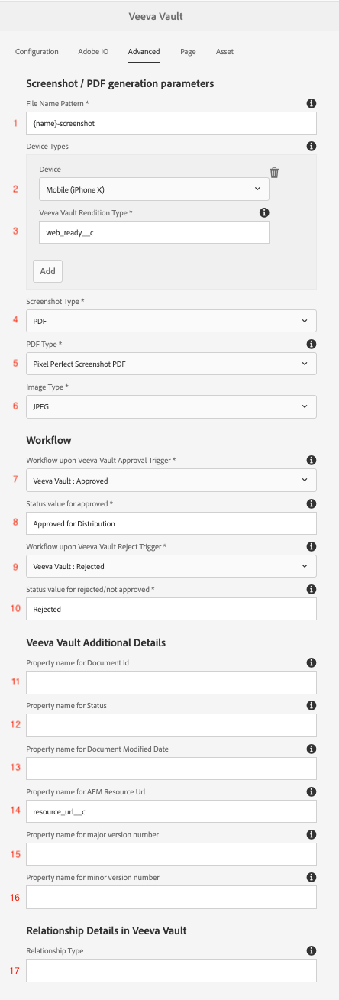
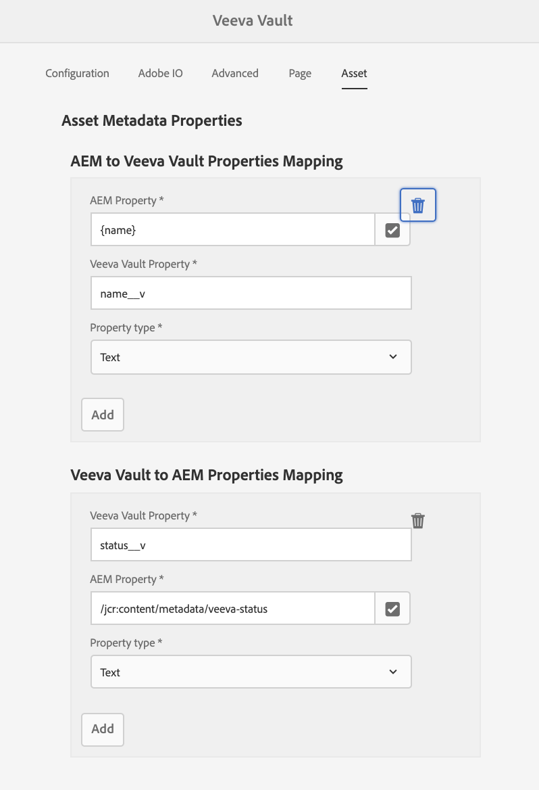

# Uso de integración

## Tutorial

En el siguiente vídeo explicativo se describe el uso del conector:

>[!VIDEO](https://video.tv.adobe.com/v/332137/?quality=12&learn=on)

## Configuración

Esta guía le guiará para poner en marcha el conector.

>[!IMPORTANT]
>
>Para cada sistema, un **administrador** debe realizar estos pasos con cada sistema.
>
>Los pasos de esta documentación le guiarán a través de la creación de integraciones/registros que impliquen la asignación de permisos o acceso de administrador.  Es su responsabilidad asegurarse de que estos pasos cumplan con las políticas de su compañía antes de realizarlos, y realizarlos cuidadosamente.
>

### Instalación del paquete de integración

AEM Recibirá acceso al paquete de integración de la. Existen dos opciones para instalar la integración:

1. **Instalación de paquetes** - Directa y menos involucrada.
2. **Instalación de POM**: más avanzada, pero puede resultar útil al usar AEM Cloud Manager y actualizar la integración.

#### Instalación de paquetes

Para instalar el paquete, descárguelo con el vínculo que aparece en el correo electrónico de incorporación. AEM [Encontrará instrucciones detalladas para la instalación de un paquete de haciendo clic aquí.](https://experienceleague.adobe.com/docs/experience-manager-64/administering/contentmanagement/package-manager.html?#installing-packages)

#### Instalación de POM

Para incluir el conector en el POM, siga estos pasos. Reemplace su nombre de usuario y contraseña por los que recibió en el correo electrónico de incorporación.

1. Agregue lo siguiente al archivo `.cloudmanager/maven/settings.xml` de su proyecto o a `~/.m2/settings.xml` de su equipo. Reemplace `YOUR_USERNAME` con el nombre de usuario y `YOUR_PASSWORD` con la contraseña proporcionada en el correo electrónico de incorporación.

   >[!IMPORTANT]
   >
   >Si usa Cloud Manager, el enfoque seguro es seguir los pasos que se encuentran aquí para [repositorios Maven protegidos por contraseña](https://experienceleague.adobe.com/docs/experience-manager-cloud-service/onboarding/getting-access/create-application-project/setting-up-project.html?lang=en#password-protected-maven-repositories).
   >

   ```
   <settings>
       ...
       <servers>
           ...
           <server>
               <id>repo.ea.adobe.net</id>
               <username>YOUR_USERNAME</username>
               <password>YOUR_PASSWORD</password>
               <filePermissions>BucketOwnerFullControl</filePermissions>
               <configuration>
                 <wagonProvider>s3</wagonProvider>
               </configuration>
           </server>
           ...
       </servers>
       ...
   </settings>
   ```

2. Agregue lo siguiente al archivo `pom.xml` del proyecto:

   ```
   <project>
       ...
       <build>
           ...
           <extensions>
               ...
               <extension>
                   <groupId>com.allogy.maven.wagon</groupId>
                   <artifactId>maven-s3-wagon</artifactId>
                   <version>1.2.0</version>
               </extension>
               ...
           </extensions>
           ...
       </build>
       ...
       <repositories>
           ...
           <repository>
               <id>repo.ea.adobe.net</id>
               <url>s3://repo.ea.adobe.net/release</url>
               <releases>
                   <enabled>true</enabled>
               </releases>
           </repository>
           ...
       </repositories>
       ...
   </project>
   ```

3. Agregue lo siguiente al archivo `all/pom.xml` del proyecto. Reemplace `project.dependencies.dependency.version` por la versión apropiada y `project.build.plugins.plugin.configuration.embeddeds.embedded.target` por la ruta de acceso correcta.

   ```
   <project>
       ...
       <build>
           ...
           <plugins>
               ...
               <plugin>
                   <groupId>org.apache.jackrabbit</groupId>
                   <artifactId>filevault-package-maven-plugin</artifactId>
                   ...
                   <configuration>
                       ...
                       <embeddeds>
                           ...
                           <embedded>
                               <groupId>com.adobe.acs.aemveeva</groupId>
                               <artifactId>aem-veeva-connector.all</artifactId>
                               <type>zip</type>
                               <target>/apps/APP_NAME-packages/application/install</target>
                           </embedded>
                           ...
                       </embeddeds>
                   </configuration>
               </plugin>
               ...
           </plugins>
           ...
       </build>
       ...
       <dependencies>
           ...
           <dependency>
               <groupId>com.adobe.acs.aemveeva</groupId>
               <artifactId>aem-veeva-connector.all</artifactId>
               <version>1.0.5</version>
               <type>zip</type>
           </dependency>            
           ...
       </dependencies>
       ...
   </project>
   ```

### Configuración de nube

Esta integración se configura creando una configuración de nube en la carpeta en la que funcionará el conector. Siga estos pasos para crear una configuración de nube:

1. Vaya a la configuración de nube de Veeva.

   

2. Cree una nueva configuración de nube de Veeva en la carpeta adecuada y rellene el como se describe en las secciones siguientes.

   

#### Pestaña Configuración

Complete lo siguiente en la pestaña de configuración:


1. Requerido. Título para la configuración del conector de Veeva Vault. Puede ser un valor arbitrario. (p. ej. `Veeva Vault Configuration`)
2. Requerido. La URL de dominio de la instancia de Veeva (p. ej. `https://my-instance.veevavault.com/`)
3. Requerido. Se requiere ClientID para llamar a la API de Veeva Vault. Puede ser un valor arbitrario y se utiliza principalmente para la depuración. (p. ej. `adobe-aem-vvtechpartner`)
4. Requerido. Nombre de usuario de Veeva Vault. Ver [Creación de usuarios de Veeva](#veeva-user-creation).
5. Requerido. Contraseña de Veeva Vault. Ver [Creación de usuarios de Veeva](#veeva-user-creation).

#### Pestaña E/S de Adobe

Si el proyecto necesita generar PDF o imágenes para las páginas, esta pestaña es obligatoria. Complete lo siguiente en la pestaña Adobe IO:


1. Requerido. Extremo de E/S de Adobe para crear imágenes de PDF proporcionado en el correo electrónico de incorporación. (p. ej. `https://my-namespace.adobeioruntime.net/api/v1/web/aem-veeva-serverless-0.0.2/trigger-action.json`)
2. Requerido. Nombre de la acción para la generación de imágenes de página. Este valor debe ser `aem-veeva-integration/get-image-async`.
3. Requerido. Nombre de la acción para la generación de imágenes HTML. Este valor debe ser `aem-veeva-integration/get-pdf-async-new`.
4. Requerido. El extremo de E/S de Adobe para obtener el estado de la generación que se proporcionó en el correo electrónico de incorporación.(p. ej. `https://my-namespace.adobeioruntime.net/api/v1/web/aem-veeva-serverless-0.0.2/get-state-value`)
5. Requerido. AEM Nombre de usuario de que utilizará Adobe IO. AEM Consulte [Creación de usuarios de la](#aem-user-creation).
6. Requerido. AEM Contraseña de que utilizará IO de Adobe. AEM Consulte [Creación de usuarios de la](#aem-user-creation).
7. Opcional. El tiempo de espera predeterminado es permitir que la página responda hasta un momento especificado después del cual el servicio AIO deje de intentar obtener una respuesta. El valor predeterminado es `30000`.
8. Opcional. El retraso es después de que la página haya respondido con 200 para retrasar todas las imágenes que se procesarán antes de tomar una captura de pantalla. El valor predeterminado es `2000`.
9. Opcional. La URL generada por la captura de pantalla o el PDF caducará después de configurar el valor en segundos.
10. Opcional. El servicio de generación de PDF/captura de pantalla de E/S de Adobe es asincrónico. AEM El servicio llama al extremo de estado de AIO para obtener la captura de pantalla/PDF. Esta propiedad decidirá en milisegundos la pausa entre cada llamada de estado. El valor predeterminado es `10000`.
11. Opcional. Recuento máximo de reintentos de llamada de estado a E/S de Adobe para obtener captura de pantalla/PDF. El valor predeterminado es `10`.

#### Pestaña Avanzadas

Complete lo siguiente en la pestaña avanzada:



1. Necesario para la generación de PDF/imágenes. Patrón de nombre de archivo utilizado al crear PDF e imágenes. `{name}` se puede crear una plantilla. (p. ej. `{name}-screenshot`)
2. Opcional. Los tipos de dispositivo para los que se requieren capturas de pantalla de página que no sean de escritorio. Los tipos válidos incluyen `Tab (iPad)` y `Mobile (iPhone X)`.
3. Opcional. El valor del tipo de representación en Veeva que representa la representación anterior. (p. ej. `web_ready__c`)
4. Necesario para la generación de PDF/imágenes. Tipo de captura de pantalla que crear. `PDF` o `Image`.
5. Necesario para la generación de PDF/imágenes. Tipo de PDF que se va a generar. `Print CSS Based PDF` o `Pixel Perfect Screenshot PDF`.
6. Necesario para la generación de PDF/imágenes. Tipo de imagen que se va a generar. `PNG` o `JPEG`.
7. Requerido. El flujo de trabajo se ejecutará una vez que haya finalizado el déclencheur de aprobación de Veeva Vault.
8. Requerido. Valor de propiedad Status que representa Approved. (p. ej. `Approved for Distribution`)
9. Requerido. El flujo de trabajo se ejecutará una vez que se haya completado el déclencheur de rechazo de Veeva Vault.
10. Requerido. Valor de propiedad Status que representa Rechazado/No aprobado. (p. ej. `Rejected`)
11. Opcional. Nombre de propiedad para ID de documento en Veeva Vault. El valor predeterminado es `id`.
12. Opcional. Nombre de propiedad de Status en Veeva Vault. El valor predeterminado es `status__v`.
13. Opcional. Nombre de propiedad de la fecha de modificación del documento. El valor predeterminado es `version_modified_date__v`.
14. Opcional. Nombre de propiedad de la URL del recurso de documento. El valor predeterminado será `external_id__v`. Si este campo ya está en uso, cree un campo diferente en Veeva y rellene el nombre del campo aquí. AEM Este campo se utilizará en Veeva para mantener la ruta del recurso de la. Esto es necesario para la sincronización automatizada de metadatos.
15. Opcional. Nombre de propiedad para el número de versión principal en Veeva Vault. El valor predeterminado es `major_version_number__v`.
16. Opcional. Nombre de la propiedad para el número de versión menor en Veeva Vault. El valor predeterminado es `minor_version_number__v`.
17. Opcional. Valor de tipo de relación de Veeva Vault. Todos los recursos agregados a la página se representarán como relacionados en función de este valor. El valor predeterminado es `supporting_document__c`.

#### Pestaña Página

Si sincroniza páginas, complete lo siguiente en la pestaña de página:


1. Requerido. AEM Mapa de una propiedad de a Veeva.
AEM a. nombre de propiedad de la. AEM Seleccionable entre las propiedades de la. (p. ej. `jcr:title`) `{name}` se puede crear una plantilla.
b. El nombre de propiedad de Veeva introducido exactamente en existe en Veeva. (p. ej. `name__v`)\
   c. Tipo de propiedad. `Text` o `Multiline Text`.

2. Requerido. AEM Mapa una propiedad de Veeva a.
a. El nombre de propiedad de Veeva introducido exactamente en existe en Veeva. (p. ej. `name__v`)
AEM b. Nombre de propiedad de la. AEM Seleccionable entre las propiedades de la. (p. ej. `jcr:title`)
c. Tipo de propiedad. `Text` o `Multiline Text`.


#### Pestaña Recurso

Si sincroniza recursos, complete lo siguiente en la pestaña de recursos:



1. Requerido. AEM Mapa de una propiedad de a Veeva.
AEM a. nombre de propiedad de la. AEM Seleccionable entre las propiedades de la. (p. ej. `/jcr:content/metadata/jcr:title`) `{name}` se puede crear una plantilla.
b. El nombre de propiedad de Veeva introducido exactamente en existe en Veeva. (p. ej. `name__v`)
c. Tipo de propiedad. `Text` o `Multiline Text`.

2. Requerido. AEM Mapa una propiedad de Veeva a.
a. El nombre de propiedad de Veeva introducido exactamente en existe en Veeva. (p. ej. `name__v`)
AEM b. Nombre de propiedad de la. AEM Seleccionable entre las propiedades de la. (p. ej. `/jcr:content/metadata/jcr:title`)
c. Tipo de propiedad. `Text` o `Multiline Text`.

### Ajustes adicionales

#### AEM Creación de usuario de

Durante la generación de PDF AEM AEM e imágenes, es necesario crear un usuario de la imagen para obtener páginas de la creación de la imagen de un usuario de la página de la. Cree y conceda permisos de solo lectura a un usuario siguiendo estos vínculos:

AEM Si se utiliza la versión 6.5.5 (o posterior):

* AEM [Creando un usuario en el](https://experienceleague.adobe.com/docs/experience-manager-65/forms/administrator-help/setup-organize-users/adding-configuring-users.html?#create-a-user)
* AEM [Agregando permisos a un usuario en la lista de usuarios de la lista de permitidos](https://experienceleague.adobe.com/docs/experience-manager-65/administering/security/security.html?#permissions-in-aem)

AEM Si se usan Cloud Service de:

* AEM [Administración de usuarios con Cloud Service de](https://experienceleague.adobe.com/docs/experience-manager-learn/cloud-service/accessing/aem-users-groups-and-permissions.html?#accessing)

AEM Se requieren los siguientes permisos para el usuario del servicio de en el contenido que se convertirá a PDF/imagen y se insertará en Veeva:

* Lectura

>[!IMPORTANT]
>
> Estas acciones deben realizarse como administrador para cada sistema.
> Debe cumplir con los estándares de seguridad de su organización al crear usuarios y configurar permisos.
>

#### Creación de usuarios de Veeva

Para utilizar esta integración, es necesario crear un usuario en Veeva Vault. Para crear un usuario, siga estos pasos:

1. Vaya a Administración -> Usuarios y grupos -> Usuarios de Vault -> Crear

   

2. Rellene las entradas necesarias. La configuración más sencilla es establecer `License Type` en `Full User` y `Security Profile` en `Vault Owner`. Guardar cuando se complete.

   

Se requieren los siguientes permisos para los tipos de documento Veeva específicos que se están utilizando:

* Crear/leer documentos
* Crear/Leer versiones
* Crear/actualizar metadatos
* Crear/actualizar representaciones

>[!IMPORTANT]
>
> Estas acciones deben realizarse como administrador para cada sistema.
> Debe cumplir con los estándares de seguridad de su organización al crear usuarios y configurar permisos.
>
